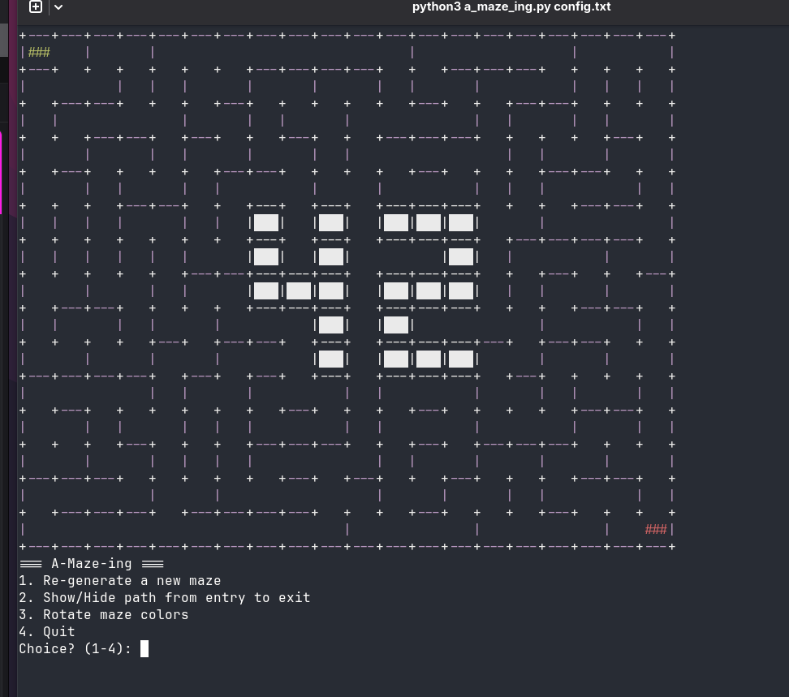

# A-Maze-ing — Personal Fork

---
### Preview
<div align="center">
  
</div>

*Personal fork of the 42 school project "A-Maze-ing", originally developed in pairs as part of the 42 curriculum. This repo is a sandbox for my own improvements, outside the school assignment.*

☕ If you like this project, you can support me here: [ko-fi.com/nicolasbgt](https://ko-fi.com/nicolasbgt)

## Description

A maze generator in Python, with two generation modes:
- **Perfect mode** (`PERFECT=True`): a single path between entry and exit, no loops at all.
- **Pac-Man mode** (`PERFECT=False`, default): a playable board, fully connected, with at least two independent routes, reachable corners and centre, and few dead-ends.

The maze always includes a visible "42" pattern, drawn by fully closed cells.

## Current status

- Maze generation (iterative DFS + loop/braid handling for Pac-Man mode)
- **Terminal ASCII** visual rendering with:
  - "42" pattern coloring
  - show/hide shortest path (entry → exit)
  - distinct coloring for entry and exit
  - wall color rotation
- Maze written to an output file in hexadecimal format (one digit per cell, walls encoded as N/E/S/W bits)
- Interactive menu: regenerate, toggle path, rotate colors, quit
- `mazegen` module packaged separately and reusable (pip-installable)

## Planned improvements (personal, outside the school scope)

- Move to a graphical rendering using the **MiniLibX** library, in addition to (or instead of) the current terminal ASCII rendering.

## Usage

```bash
python3 a_maze_ing.py config.txt
```

`config.txt` is a plain text file defining the generation options (one `KEY=VALUE` pair per line, `#` for comments).

### Configuration keys

| Key | Description | Example |
|---|---|---|
| `WIDTH` | Maze width (number of cells) | `WIDTH=20` |
| `HEIGHT` | Maze height | `HEIGHT=15` |
| `ENTRY` | Entry coordinates (x,y) | `ENTRY=0,0` |
| `EXIT` | Exit coordinates (x,y) | `EXIT=19,14` |
| `OUTPUT_FILE` | Output filename | `OUTPUT_FILE=maze.txt` |
| `PERFECT` | Whether the maze is perfect | `PERFECT=True` |

Additional optional keys (seed, algorithm, display mode) can be added as needed.

## Installation

```bash
make install
```

Installs the development dependencies (flake8, mypy, pytest) listed in `requirements.txt`.

## Makefile commands

- `make install` — install dependencies
- `make run` — run the program (`python3 a_maze_ing.py config.txt`)
- `make debug` — run the program in debug mode (pdb)
- `make clean` — remove temporary files (`__pycache__`, `.mypy_cache`)
- `make lint` — check the code (flake8 + mypy)
- `make lint-strict` — stricter check (mypy --strict)

## Project structure

```
a_maze_ing.py       # entry point
app/                # config parsing, output file writing, display
mazegen/            # reusable module: maze generation
tests/              # unit tests (not submitted, not graded)
```

## Origin

Originally created as part of the 42 curriculum, in pairs. This fork is a personal space to keep improving it on my own.

---
---

# A-Maze-ing — Fork personnel

*Fork personnel du projet 42 "A-Maze-ing", développé à l'origine en binôme dans le cadre du cursus 42. Ce repo sert de bac à sable pour mes propres améliorations, en dehors du cadre scolaire.*

☕ Si le projet vous plaît, vous pouvez me soutenir ici : [ko-fi.com/nicolasbgt](https://ko-fi.com/nicolasbgt)

## Description

Générateur de labyrinthes en Python, avec deux modes de génération :
- **Mode parfait** (`PERFECT=True`) : un unique chemin entre l'entrée et la sortie, aucune boucle.
- **Mode Pac-Man** (`PERFECT=False`, par défaut) : plateau jouable, entièrement connecté, avec au moins deux routes indépendantes, coins et centre accessibles, et peu de culs-de-sac.

Le labyrinthe intègre toujours un motif "42" visible, dessiné par des cellules totalement fermées.

## État actuel

- Génération de labyrinthe (DFS itératif + gestion des boucles/braid pour le mode Pac-Man)
- Rendu visuel en **ASCII terminal** avec :
  - coloration du motif "42"
  - affichage/masquage du plus court chemin (entrée → sortie)
  - coloration distincte de l'entrée et de la sortie
  - rotation des couleurs de murs
- Écriture du labyrinthe dans un fichier de sortie au format hexadécimal (un chiffre par cellule, murs codés en bits N/E/S/W)
- Menu interactif : régénération, affichage du chemin, rotation des couleurs, quitter
- Module `mazegen` packagé séparément et réutilisable (installable via pip)

## Améliorations prévues (perso, hors cadre scolaire)

- Passage à un rendu graphique via la librairie **MiniLibX**, en complément (ou en remplacement) du rendu ASCII terminal actuel.

## Usage

```bash
python3 a_maze_ing.py config.txt
```

`config.txt` est un fichier texte définissant les options de génération (une paire `KEY=VALUE` par ligne, commentaires avec `#`).

### Clés de configuration

| Clé | Description | Exemple |
|---|---|---|
| `WIDTH` | Largeur du labyrinthe (nombre de cellules) | `WIDTH=20` |
| `HEIGHT` | Hauteur du labyrinthe | `HEIGHT=15` |
| `ENTRY` | Coordonnées de l'entrée (x,y) | `ENTRY=0,0` |
| `EXIT` | Coordonnées de la sortie (x,y) | `EXIT=19,14` |
| `OUTPUT_FILE` | Nom du fichier de sortie | `OUTPUT_FILE=maze.txt` |
| `PERFECT` | Labyrinthe parfait ou non | `PERFECT=True` |

D'autres clés optionnelles (seed, algorithme, mode d'affichage) peuvent être ajoutées selon les besoins.

## Installation

```bash
make install
```

Installe les dépendances de développement (flake8, mypy, pytest) listées dans `requirements.txt`.

## Commandes Makefile

- `make install` — installer les dépendances
- `make run` — lancer le programme (`python3 a_maze_ing.py config.txt`)
- `make debug` — lancer le programme en mode debug (pdb)
- `make clean` — supprimer les fichiers temporaires (`__pycache__`, `.mypy_cache`)
- `make lint` — vérifier le code (flake8 + mypy)
- `make lint-strict` — vérification renforcée (mypy --strict)

## Structure du projet

```
a_maze_ing.py       # point d'entrée
app/                # parsing config, écriture du fichier de sortie, affichage
mazegen/            # module réutilisable : génération du labyrinthe
tests/              # tests unitaires (non soumis, non notés)
```

## Origine

Projet créé à l'origine dans le cadre du cursus 42, en binôme. Ce fork est un espace personnel pour continuer à l'améliorer de mon côté.
